# Prova — Your Personal Document Assistant

> Upload your bills, policies, and leases. Ask anything. Get answers with the exact page they came from.

Prova is a private document assistant. It reads your PDFs, remembers dates and amounts, and answers questions like “when does my car insurance expire?” with a source chip that points to the file, page, and quote. If it needs to do something for you — create a task, share a document — it asks first.

I built it because paperwork is where life hides deadlines. Prova keeps them where you can see them.

## Overview

Drop a PDF in. Prova pulls the text page by page, chunks it, embeds it, and files away the facts (sender, amount, due date). If there’s a deadline, it drafts a task.

Ask a question and it looks up your own documents first. Simple questions get a direct answer with citations. Harder ones that span multiple files run as a visible stream — “checked your policy… comparing against the quote…” — so you see progress instead of staring at a spinner. Every fact comes with `[Source: filename, Page N]` that you can click.

Nothing important happens without you. Actions that touch the outside world sit as approval cards on your dashboard. Approve or reject in one tap. Everything is private to your account; sharing only happens if you share by email.

## Features

- **Answers from your documents, not guesses.** It searches first, then answers. If your files don’t have the answer, it says so.
- **Proof with every fact.** Citations are enforced — the app only accepts references to text the model actually saw. No fake page numbers.
- **Cross-document comparisons, out loud.** Comparisons stream over SSE so long runs don’t time out and you see each step.
- **You’re the gate.** External actions pause as `pending_actions`. They expire after 24 hours, and every decision is logged.
- **Deadlines that nudge you.** Documents expiring in 30 days show up in the notification center with a live feed. Tasks are auto-drafted from due dates.
- **Share carefully, charge fairly.** Share a lease or warranty by email (view or editor, Pro). Free is 5 documents; Pro is ₹99/month for unlimited, comparisons, approvals, calendar exports, and sharing. Upgrade via Razorpay or one tap in demo mode.
- **Doesn’t fall over.** If the AI is slow, your upload is still saved and searchable (marked for review). Scanned-image PDFs get a clear message instead of failing silently.

## Benchmark Results

| Operation | Measured | Notes |
|-----------|----------|-------|
| Async ingestion (upload-async → `ready`) | ~18 s (17.6 s) | Embed + extract 200 each, 2 chunks, `ingestion_complete` SSE |
| Cited chat turn (120B, single-doc) | ~5 s | Correct answer + page-1 citation chip |
| Fast-lane chat (single retrieval) | 6–7 s (7.4 s / 6.2 s) | Default for everything except comparisons/actions |
| Summary (“explain this document”) | ~11 s (10.9 s) | Templated sections, citations, leak guards |
| Comparison (multi-doc agent loop) | ~26 s (25.6 s) | 3 scoped searches + cited matrix |
| Stream first token | ~2 s | Tokens render live; citations land on final event |
| Cold login (idle Neon wake) | 3.4 s | Warm logins are faster |
| Rate-limit trip | 429 + `Retry-After` | Auth 5/min verified live |
| Delete → transparency log | 204, 0 docs / 0 chunks / 5 audits | Full cascade verified |

## Architecture

```mermaid
flowchart TB
    classDef ingest fill:#172554,stroke:#3b82f6,color:#dbeafe
    classDef query fill:#052e16,stroke:#22c55e,color:#dcfce7
    classDef trust fill:#451a03,stroke:#f59e0b,color:#fef3c7

    subgraph INGEST [Ingestion]
        A[PDF ≤25MB] --> B[PyMuPDF]
        B --> C[Chunk 400t/60 + Embed 2048]
        B --> D[Extract JSON]
        C --> E[(Neon + pgvector)]
        D --> E
        D --> F[tasks + notifications]
    end
    subgraph QUERY [Query]
        G[Question] --> H[FastAPI + LangGraph]
        H --> I[Tools: search / query / synthesize]
        I --> E
        E --> J[Tool output]
        J --> H
        H --> K[NIM 120B]
        K --> L[Cited Answer]
    end
    subgraph TRUST [Approvals & Sharing]
        I --> M[pending_actions]
        M --> N[Approval card]
        N --> H
        O[Share by email] --> P[document_shares]
        P --> E
    end

    class A,B,C,D,E,F ingest
    class G,H,I,J,K,L query
    class M,N,O,P trust

    style INGEST fill:#0f172a,stroke:#3b82f6,stroke-width:2px
    style QUERY fill:#022c22,stroke:#22c55e,stroke-width:2px
    style TRUST fill:#431407,stroke:#f59e0b,stroke-width:2px
```



### How it runs

How the pieces are deployed and scaled:

```
                ┌─────────────┐   HTTPS    ┌──────────────────┐
                │  Next.js 15 │ ─────────► │  backend-api x4  │
                │  frontend   │ ◄───────── │  FastAPI workers │
                │  :3000      │    SSE     │  :8000           │
                └─────────────┘            └────┬───┬─────────┘
                                                │   │
                              shared_uploads    │   │  document_pipeline / celery_dlq
                              /app/uploads      │   ▼
                           ┌────────────────────┐  ┌──────────────┐
                           │   celery-worker xN │◄─│ Redis 7+     │
                           │   --max-tasks-     │  │ broker+result│
                           │   per-child=50     │  │ + Pub/Sub    │
                           └────────┬───────────┘  └──────────────┘
                                    │ NullPool, one conn/task
                                    ▼
                           ┌────────────────────┐      ┌──────────────────┐
                           │ Neon PostgreSQL    │◄─────│ NVIDIA NIM       │
                           │ pgvector halfvec   │ NIM  │ chat + embeddings│
                           │ RLS FORCE policies │ API  │ (transient only) │
                           └────────────────────┘      └──────────────────┘
```

## Tech Stack

| Area | Details |
|------|---------|
| Frontend | Next.js 15.1.6 (App Router), React 19, TypeScript, Tailwind CSS |
| Backend | Python 3.11, FastAPI 0.115.6, Uvicorn, SQLAlchemy (async) + asyncpg — async API and Postgres access |
| AI | NVIDIA NIM — `nemotron-3-super-120B` for chat/tools + `nemotron-3-embed-1b` (2048-dim) for embeddings — via `openai.AsyncOpenAI`; `httpx` 15s → 30s + 1 retry |
| Orchestration | LangGraph 0.2.59 + `AsyncPostgresSaver` on Neon — handles approval pause/resume; falls back to plain loop if checkpoint table missing |
| Database | Neon Serverless Postgres + `pgvector` `halfvec(2048)` HNSW — one DB for data + vectors; RLS `FORCE` with dual `id` + `email` for tenant isolation |
| Parsing | PyMuPDF (`fitz`) — extracts text page by page, keeps order, reads form widgets, flags scanned images; saves `page_number` for citations |
| Auth | Self-managed JWT (`PyJWT` + `bcrypt`) — token carries `id` + `email` so RLS can allow owner OR shared users |
| Billing | Razorpay 1.4.2 Test Mode (`rzp_test_*`) — checkout + HMAC webhook; flips to demo mode if keys missing |
| Realtime | `sse-starlette` — streams chat and notifications over SSE (`POST /chat/stream`, `GET /notifications/stream`) |
| Deploy | Vercel (frontend), Render + Docker (`render.yaml` Blueprint), Neon (DB) — no cluster to manage |

## Technical Decisions Log

| Decision | Alternatives | Why |
|---|---|---|
| Neon + `pgvector` `halfvec(2048)` HNSW | Pinecone / Qdrant | One database for data and vectors. `halfvec` uses half the memory, HNSW is fast at our scale. No extra service to pay for or run, and it fits Neon's 10-connection pooled limit. |
| NIM `120B` + `embed-1b` | OpenAI | We already have NIM credits. Cheaper for India, and if it's down we mark docs `needs_review` instead of failing the upload. |
| LangGraph + `AsyncPostgresSaver` | Plain loop / Temporal | Approvals must survive restarts. Graph checkpoints in Postgres let us pause, wait for your tap, then resume. If the table isn't there, the plain loop still works. |
| Celery + Redis (`document_pipeline` + `celery_dlq`) | RQ / SQS | Ingestion is slow. Celery lets us cap concurrency, retry with backoff, and isolate bad files in a real DLQ. |
| PyMuPDF | pdfminer / pypdf | Citations need exact page numbers. PyMuPDF keeps reading order, reads widgets, and tells us if a page is just a scanned image. |
| Self-managed JWT (dual GUC) | Clerk / Auth0 | Sharing is by email. Our JWT carries both `id` and `email` so RLS can check owner OR shared recipient without an external auth service. |
| `RLS FORCE` + SSE | App filters / WebSockets | RLS in the DB guarantees isolation even if app code forgets a filter. SSE is one-way, works behind Render/Vercel proxies, and is enough for streaming. |
| Razorpay + HMAC webhook | Stripe | UPI and cards matter in India. Webhook checks HMAC and fails closed. No keys → demo mode so local dev has no friction. |
| Render + Vercel + Neon pooler | K8s / ECS | No cluster to manage. Blueprint gives 4 API workers, `pg_advisory_lock` stops migrations from hanging boot, pooler keeps us under 10 connections. |

## Project Structure

```text
Prova/
├── backend/
│   ├── Dockerfile               # init_db + uvicorn on $PORT, /health check
│   ├── app/
│   │   ├── main.py              # FastAPI, CORS, 504/502 handlers, /health (langgraph/tier flags), /
│   │   ├── config.py            # Settings (DATABASE_URL, NVIDIA_*, JWT, FREE_DOCUMENT_LIMIT, Razorpay, SYNTHESIZE caps)
│   │   ├── database.py          # normalize_database_url, engine, RLS id+email helpers, audit
│   │   ├── nim.py               # AsyncOpenAI client, embed_texts / chat_completion(timeout, retries)
│   │   ├── ingestion.py         # PyMuPDF (sort/widgets/scan flags), chunker, extraction + fallback
│   │   ├── schemas.py           # Pydantic v2 + Share / PendingAction / Notification / Checkout schemas
│   │   ├── security.py          # bcrypt + JWT (CurrentUser id+email)
│   │   ├── agent/
│   │   │   ├── loop.py          # tier-aware tool loop (fallback engine), free hides synthesize
│   │   │   ├── graph.py         # LangGraph StateGraph + interrupt() gate + AsyncPostgresSaver
│   │   │   └── tools.py         # 6 tools, owner-OR-shared SQL: search, query, create, synthesize, propose, calendar
│   │   ├── services/
│   │   │   ├── billing.py       # check_tier_limit(403), require_pro, Razorpay/demo checkout + webhook
│   │   │   └── notifications.py # 30-day deadline sync, pending TTL expiry, SSE frames
│   │   └── routers/
│   │       ├── auth.py          # signup / login / me (tier + count)
│   │       ├── documents.py     # tier-gated upload, owner-OR-shared list, share CRUD (Pro create)
│   │       ├── chat.py          # render_citations (verbatim 20-word) + POST /chat/stream (SSE)
│   │       ├── tasks.py         # list (due-date order) + PATCH + DELETE(204) + GET /{id}/calendar (.ics, Pro)
│   │       ├── pending_actions.py # list pending + POST /{id}/decide (approve executes, resumes graph)
│   │       ├── notifications.py # list (auto-syncs deadlines) + PATCH read + DELETE + GET /stream
│   │       └── billing.py       # /status + /create-checkout-session + /webhook
│   ├── schema.sql               # Phase 1 DDL + halfvec HNSW + RLS FORCE + tenant policies
│   ├── migrations/phase2.sql    # tiers, shares, pending_actions, notifications + shared-access RLS
│   ├── requirements.txt         # Pinned (fastapi 0.115.6, langgraph 0.2.59, razorpay 1.4.2, sse-starlette 2.2.1, ...)
│   └── .env.example
├── frontend/
│   ├── src/app/page.tsx         # Dashboard (tier badge, bell, approvals card, share, streamed chat)
│   ├── src/app/pricing/page.tsx # Free vs Pro + Razorpay/demo upgrade
│   ├── src/app/notifications/page.tsx # Alert center (30-day deadlines, shares, system)
│   ├── src/app/login/page.tsx   # Sign in / Create account
│   ├── src/components/ApprovalModal.tsx  # approve/reject drafted actions
│   ├── src/components/ShareDialog.tsx    # email share + permission + revoke
│   ├── src/components/CitationChip.tsx   # interactive source chips
│   ├── src/components/ChatPane.tsx  # SSE stream with live stage text, scope select
│   ├── src/components/DocumentList.tsx, Dropzone.tsx, TaskList.tsx  # share btn, 403 notices, .ics download
│   ├── src/lib/api.ts, src/lib/sse.ts, src/lib/utils.ts
│   └── next.config.ts, tailwind.config.ts, tsconfig.json, .env.local.example
├── render.yaml                  # Render Blueprint (Docker web service + env vars)
├── README.md
├── RUN.md
└── .gitignore
```


> For running this project, see **RUN.md** — Docker quick start, manual dev, health checks, and curl demo.


Built with ❤️
