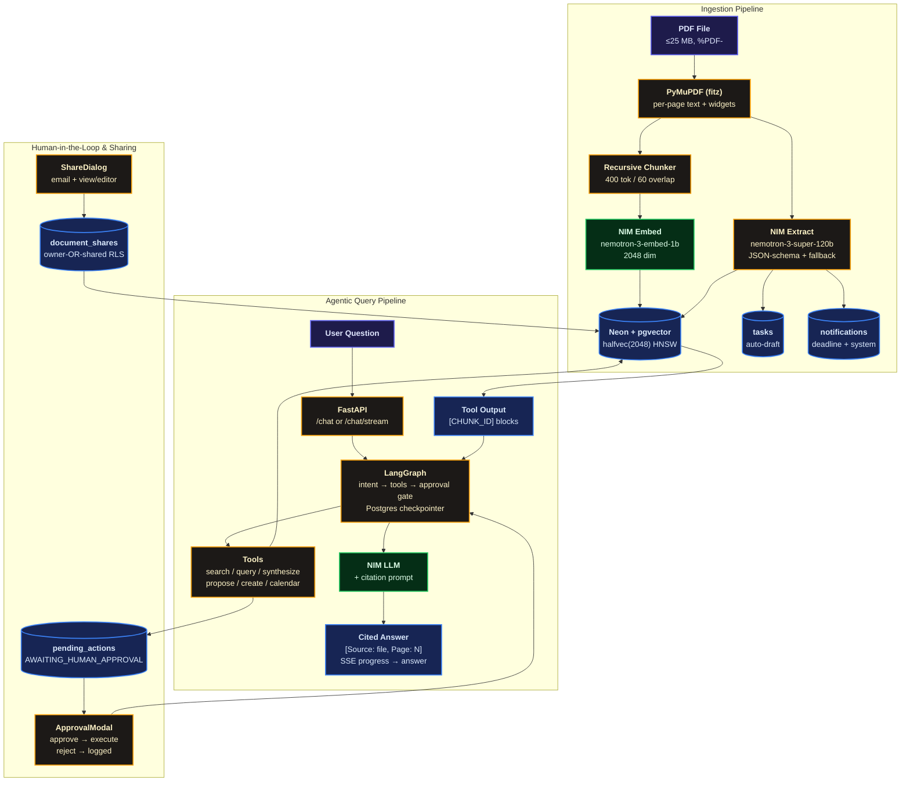

# Prova — Your Personal Document Assistant

> Prova reads your bills and policies, answers questions with proof, compares documents, and asks before doing anything important.

Adult life runs on paperwork — bills, renewals, rental agreements — with the dates that matter buried inside PDFs. Prova is a private assistant that reads those documents, remembers every deadline, and answers questions like "when does my car insurance expire?" while pointing at the exact page it got the answer from.

## Overview

Upload a PDF and Prova reads every page, files away the key facts (sender, amount, due date), and drafts a task if there's a deadline. Ask a question and it looks up your documents — checking each file step by step, live, for harder comparisons — then answers with a source chip after every fact: filename, page, exact quote.

When it wants to *do* something rather than answer, it pauses and shows you an approval card. One tap to confirm or reject. Everything stays private to your account; sharing only happens when you share by email.

## Features

- **An agent that looks things up before answering** — instead of following one fixed script, it decides on its own what to search for, checks its sources, and only then answers. If your documents don't contain the answer, it says so instead of making something up.
- **Answers with proof attached** — every fact comes with a clickable source chip showing the document, page, and exact quote. A wrong citation is impossible by design: the app only accepts references to text it actually showed the AI.
- **Compares documents, out loud** — Pro questions spanning two files run as a visible step-by-step stream ("checked your policy… comparing against the quote…") instead of a long silent wait that hosting platforms would kill halfway.
- **Nothing important happens without you** — external actions pause as approval cards on the dashboard. One tap to approve or reject; the decision is logged either way.
- **Deadlines chase you, gently** — documents expiring within 30 days raise alerts in the notification center with a live feed, and uploads with due dates still draft tasks automatically.
- **Share with family, charge fairly** — share a lease or warranty by email with view or editor access (Pro). Free covers 5 documents; Pro (₹99/mo) unlocks unlimited uploads, comparisons, approvals, calendar exports, and sharing — upgrade via Razorpay or one tap in demo mode.
- **Survives bad days gracefully** — if the AI service is slow or down, your upload is still saved and searchable; the document is simply marked for review rather than breaking the whole page. Scanned-image PDFs get a clear explanation instead of a silent failure.

## Phase 2 implementations

What Phase 2 adds on top of the Phase 1 MVP:

- **Cross-document reasoning** — `synthesize_documents` scatters one scoped search per file and gathers a cited comparison matrix, streamed over SSE (`POST /chat/stream`) so long syntheses show live progress instead of timing out.
- **Human-in-the-loop approvals** — `propose_task_action` drafts to `pending_actions`; the dashboard's approval card executes on approve, logs on reject, expires after 24 h. A LangGraph state machine (`AsyncPostgresSaver`) orchestrates the pause/resume; the built-in loop remains as fallback.
- **Document sharing** — email-based shares with view/editor permission, owner-OR-shared RLS on documents and chunks, recipient notifications.
- **SaaS tiers + billing** — free (5 docs, single-doc Q&A) vs Pro (₹99/mo: unlimited, synthesis, approvals, calendar, sharing); Razorpay checkout + webhook, demo-mode instant flip without keys.
- **Notification center** — 30-day deadline sync, upload/share/system alerts, live SSE feed, unread badge.
- **Calendar export** — one-tap `.ics` download per task (Pro).
- **Cloud-ready** — `render.yaml` Blueprint + Dockerfile (migrations on boot), Vercel frontend config.

## Phase 3 implementations

What Phase 3 adds on top of the Phase 2 product (this repo):

- **Async ingestion queue** — `POST /documents/upload-async` returns **202 Accepted**
  with `document_id` + `job_id`; Celery workers (`document_pipeline` queue, bounded
  concurrency, `--max-tasks-per-child=50`) run parse → extract → chunk → embed with
  stage-boundary cancellation checks. Progress streams over Redis Pub/Sub → SSE
  (`GET /notifications/live`); the sync `/upload` endpoint stays as the no-Redis fallback.
- **Real Dead-Letter Queue** — failures after max retries dispatch to `celery_dlq`
  (`handle_poison_pill_dlq` marks the doc `failed`, writes a `dlq_ingest` audit row,
  pushes a `document_failed` SSE alert). Upload-commit race resolves via backoff retry.
- **Database-level multi-tenancy** — dual tenant GUCs (`app.current_user_id` +
  `app.current_user_email`) enforced on every path including Celery (`NullPool` worker
  engine); split `audit_logs` SELECT/INSERT RLS policies (system/DLQ rows allowed);
  pooled web engine (`pool_size=5, max_overflow=5`, Neon `-pooler :6543`).
  Migrations run at boot under `pg_advisory_lock` (`migrations/phase3.sql`).
- **Prompt-injection firewall** — `<untrusted_document_context>` envelopes, non-execution
  system directives, token-buffered canary inspection on chat streams (`CANARY_` sliding window).
- **Abuse control + observability** — Redis-backed rate limits (uploads 10/min, chat
  20/min, auth 5/min → 429 + `Retry-After`), structlog JSON logs with `X-Correlation-ID`,
  `/api/health/liveness` + `/api/health/readiness` probes.
- **Verified deletion** — soft-cancel-first document delete (vectors, shares, drafted
  actions, binary, `hard_delete` audit) and full account purge (`POST /api/user/purge-account`,
  both LangGraph thread formats), plus `GET /api/privacy/transparency-log`.
- **Packaging + docs** — `docker-compose.yml` (API ×4, worker, Redis 7, frontend,
  `shared_uploads` volume), frontend `/chat` (rate-limit toasts), `/settings` (transparency + purge),
  `ProcessingCard` queue stepper, two-step `DeletionModal`.
- **Fast chat** — `CHAT_MODEL` (nano-omni 30B) + single-pass fast lane (<10s) for everything
  except comparison/action intent, which escalate to the 120B agent loop.

## Live-run notes (verified 2026-09-11, Docker + Neon + Redis + NIM)

- `docker compose up --build -d` serves API `:8000`, frontend `:3000`; Compose reads
  repo-root `.env` (billing keys live there, not `backend/.env`).
- Billing runs the **live Razorpay test path** (Key ID + Key Secret + Plan ID wired;
  webhook secret optional — checkout opens without it, only the post-payment tier flip
  needs it). With no keys at all it falls back to demo-mode instant upgrade.
- Sync uploads insert transient `processing` status — included in `chk_documents_status`.

## Benchmark Results

Observed on Docker Compose + Neon + Redis 7 + NVIDIA NIM (live run 2026-09-11;
chat tuning 2026-09-13). Small PDFs (2 chunks) — NIM latency moves with server
load, so read these as observed numbers, not guarantees.

| Operation | Measured | Notes |
|-----------|----------|-------|
| Async ingestion (upload-async → `ready`) | ~18 s (17.6 s) | Embeddings 200, extraction 200, 2 chunks, `ingestion_complete` SSE |
| Cited chat turn (120B, single-doc) | ~5 s | Correct answer + page-1 citation chip |
| Fast-lane chat (single retrieval + short call) | 6–7 s (7.4 s / 6.2 s) | Default path except comparison/action intent |
| Summary ("explain this document") | ~11 s (10.9 s) | Templated sections, citations, leak guards |
| Comparison (multi-doc agent loop) | ~26 s (25.6 s) | 3 scoped searches + cited matrix |
| Stream first token | ~2 s | Tokens render live; citations resolve on final event |
| Cold login (idle Neon wake) | 3.4 s | Warm logins are faster |
| Rate-limit trip | 429 + `Retry-After` | Auth 5/min verified live |
| Delete → transparency log | 204, 0 docs / 0 chunks / 5 audits | Full cascade verified |

Tuning rejections (same key, measured): reasoning nano-30B thinks ~45–50 s per
turn; Lightning-30B answers fast (~16 s) but poorly; nano-3-30B and kimi-k2.6
are not entitled on this key (404). Chat stays on the 120B.

## Architecture



## Tech Stack

| Layer | Technology |
|-------|------------|
| Frontend | Next.js 15.1.6 (App Router, React 19) + TypeScript + Tailwind CSS + Tabler.io (`@tabler/core` 1.5.1, `@tabler/icons-react` 3.46.0) |
| Backend | Python 3.11 + FastAPI 0.115.6 + Uvicorn + SQLAlchemy[asyncio] + asyncpg |
| AI | NVIDIA NIM `nemotron-3-super-120b-a12b` (tool calling) + `nemotron-3-embed-1b` (2048) via `openai.AsyncOpenAI` + `httpx` (15 s default; 30 s + 1 retry for chat turns and extraction) |
| Orchestration | LangGraph 0.2.59 + `AsyncPostgresSaver` (same Neon DB; optional — falls back to the built-in loop) + `langchain-openai` |
| Data | Neon Serverless Postgres + `pgvector` (`vector(2048)` → `halfvec(2048)` HNSW `halfvec_cosine_ops`) + RLS `FORCE` (id + email) |
| Parsing | PyMuPDF (`fitz`) — sorted reading order, block fallback, AcroForm widgets, scanned-page detection; `page_number` preserved for citations |
| Auth | Self-managed JWT (`PyJWT` + `bcrypt` 72B cap) carrying id + email for shared-access RLS |
| Billing    | Razorpay 1.4.2 (Test Mode `rzp_test_*`); `/webhook` is HMAC-authed by signature (no JWT) and needs `RAZORPAY_WEBHOOK_SECRET`; demo-mode instant flip when keys are absent |
| Realtime | `sse-starlette` — `POST /chat/stream` progress frames + `GET /notifications/stream` live feed |
| Deploy | Vercel (frontend) · Render / Docker (backend, `render.yaml` Blueprint) · Neon (db) |

## Data Model

| Table | Purpose | RLS |
|-------|---------|-----|
| `users` | self-managed identity + `subscription_tier` (`free`/`pro`), `razorpay_customer_id`, `document_count` | — (login must read before tenant ctx) |
| `documents` | `filename`, `category`, `status` (`ready`/`needs_review`), `raw_text`, `metadata JSONB`, `has_actionable_deadline` | `FORCE`, owner-OR-shared |
| `document_chunks` | `document_id`, `user_id`, `filename`, `page_number`, `chunk_index`, `content`, `embedding vector(2048)` | `FORCE`, owner-OR-shared |
| `document_shares` | `document_id`, `owner_id`, `shared_with_email`, `permission` (`view`/`editor`) | `FORCE`, owner-OR-recipient |
| `pending_actions` | `action_type`, `payload JSONB`, `status` (`pending`/`approved`/`rejected`/`expired`), `expires_at` (+24 h) | `FORCE` |
| `notifications` | `title`, `message`, `type` (`deadline`/`system`/`sharing`), `is_read`, `due_date` | `FORCE` |
| `tasks` | `title`, `due_date DATE`, `status`, `document_id ON DELETE CASCADE` | `FORCE` |
| `audit_logs` | `action_type`, `tool_name`, `input/output JSONB`, `execution_time_ms` | `FORCE` |

Indexes: `user_id`, `metadata->>'action_deadline'`, `category`, `document_shares(shared_with_email)`, `pending_actions(status)`, unread notifications, and `USING hnsw ((embedding::halfvec(2048)) halfvec_cosine_ops)`.

Tier rules live in the API, not the database: free owners get 403 on share creation and past 5 uploads; `synthesize_documents`, calendar export, and approvals UI are Pro-gated.

## Technical Decisions Log

Trade-offs made under constraints: single Neon DB, NVIDIA NIM credit, Render 4-worker limit, and Indian billing (Razorpay).

| Decision | Alternatives | Trade-off | Why this |
|---|---|---|---|
| Neon + `pgvector` `halfvec(2048)` HNSW | Pinecone / Qdrant / `vector(2048)` | `halfvec` halves memory/storage vs `vector`; HNSW gives <10 ms ANN but higher build cost than IVFFlat; no extra vector service to operate | One DB for transactional + vector, stays inside Neon 10-conn pooled budget (`pool_size=5,max_overflow=5`). IVF would need retuning per data size. |
| NVIDIA NIM `nemotron-3-super-120B` + `nemotron-3-embed-1b` | OpenAI GPT-4o + `text-embedding-3-large` | NIM is cheaper/credit-bounded and 2048-dim; latency ~5 s cited / ~26 s comparison (measured) vs OpenAI lower variance but USD billing and 3072-dim | Credit already entitled; token-for-token cheaper for India, single `AsyncOpenAI` client. Fallback is local `needs_review` not vendor lock. |
| LangGraph `AsyncPostgresSaver` + fallback loop | Pure loop / Temporal / Step Functions | Graph gives interrupt→approve→resume with durable checkpoint; fallback loop avoids hard dep on checkpoint table | Approvals must survive restarts (24 h expiry, audit). PostgresSaver reuses Neon; no extra infra vs Temporal. |
| Celery + Redis 7 (`document_pipeline` + `celery_dlq`) | RQ / BullMQ / SQS | Celery gives bounded concurrency, `--max-tasks-per-child=50`, real DLQ dispatch; heavier than RQ, needs Redis | Need backoff retries (2→4→8 s), poison-pill isolation (`handle_poison_pill_dlq`), and stage-boundary cancellation — RQ lacks per-queue max-tasks controls. |
| PyMuPDF (`fitz`) | pdfminer.six / pypdf | PyMuPDF preserves reading order, AcroForm widgets, scanned-page flag; native dep vs pure-Python | Citations need exact `page_number`; scanned detection must fail gracefully, not silently drop text. |
| Self-managed JWT (`PyJWT` + `bcrypt`, dual GUC `id+email`) | Clerk / Auth0 / Supabase Auth | Own JWT carries both `app.current_user_id`+`email` for `RLS FORCE` owner-OR-shared; no vendor lock, but we own rotation | Sharing requires email-based RLS — external auth wouldn't propagate `shared_with_email` without custom claims. |
| `RLS FORCE` on every table | App-layer `WHERE user_id=` | DB-enforced tenant isolation closes missed-filter bugs; requires setting GUC on every session (incl. Celery `NullPool`) | Security boundary in DB, not app. Split `audit_logs` SELECT/INSERT policies allow system/DLQ rows with NULL tenant. |
| `sse-starlette` (SSE) | WebSockets / polling | SSE is one-way, works behind Render/Vercel proxies, auto-reconnects; no bidirectional overhead | Chat progress (`POST /chat/stream`) and `GET /notifications/live` are server-push only. Tokens stream live, citations resolve on final event. |
| Razorpay Test Mode → live HMAC webhook | Stripe | Razorpay supports UPI/cards + ₹99 plan natively; webhook HMAC is fail-closed if secret mismatched | Indian market; demo-mode flip when keys absent keeps dev friction zero. |
| Render (`render.yaml` Blueprint, `pg_advisory_lock` migrations) + Vercel + Neon pooler `:6543` | Kubernetes / ECS / self-hosted PG | Blueprint gives 4× API workers + disk-ephemeral warning (`/app/uploads` wipes on deploy); pooler caps at 10 conns | Minimal ops, migrations serialized by advisory lock with 4 s bounded timeout so boot never hangs. |

Rejected tunings are logged in Benchmark Results: reasoning `nano-30B` (~45 s/turn) and `Lightning-30B` (fast but poor) were measured and discarded; chat stays on 120B.

## Project Structure

```text
Prova/
├── backend/
│   ├── Dockerfile               # init_db + uvicorn on $PORT, /health check
│   ├── app/
│   │   ├── main.py              # FastAPI, CORS, 504/502 handlers, /health (langgraph/tier flags), /
│   │   ├── config.py            # Settings (DATABASE_URL, NVIDIA_*, JWT, FREE_DOCUMENT_LIMIT, Razorpay, SYNTHESIZE caps)
│   │   ├── database.py          # normalize_database_url, engine, RLS id+email helpers, audit
│   │   ├── nim.py               # AsyncOpenAI client, embed_texts / chat_completion(timeout, retries)
│   │   ├── ingestion.py         # PyMuPDF (sort/widgets/scan flags), chunker, extraction + fallback
│   │   ├── schemas.py           # Pydantic v2 + Share / PendingAction / Notification / Checkout schemas
│   │   ├── security.py          # bcrypt + JWT (CurrentUser id+email)
│   │   ├── agent/
│   │   │   ├── loop.py          # tier-aware tool loop (fallback engine), free hides synthesize
│   │   │   ├── graph.py         # LangGraph StateGraph + interrupt() gate + AsyncPostgresSaver
│   │   │   └── tools.py         # 6 tools, owner-OR-shared SQL: search, query, create, synthesize, propose, calendar
│   │   ├── services/
│   │   │   ├── billing.py       # check_tier_limit(403), require_pro, Razorpay/demo checkout + webhook
│   │   │   └── notifications.py # 30-day deadline sync, pending TTL expiry, SSE frames
│   │   └── routers/
│   │       ├── auth.py          # signup / login / me (tier + count)
│   │       ├── documents.py     # tier-gated upload, owner-OR-shared list, share CRUD (Pro create)
│   │       ├── chat.py          # render_citations (verbatim 20-word) + POST /chat/stream (SSE)
│   │       ├── tasks.py         # list (due-date order) + PATCH + DELETE(204) + GET /{id}/calendar (.ics, Pro)
│   │       ├── pending_actions.py # list pending + POST /{id}/decide (approve executes, resumes graph)
│   │       ├── notifications.py # list (auto-syncs deadlines) + PATCH read + DELETE + GET /stream
│   │       └── billing.py       # /status + /create-checkout-session + /webhook
│   ├── schema.sql               # Phase 1 DDL + halfvec HNSW + RLS FORCE + tenant policies
│   ├── migrations/phase2.sql    # tiers, shares, pending_actions, notifications + shared-access RLS
│   ├── requirements.txt         # Pinned (fastapi 0.115.6, langgraph 0.2.59, razorpay 1.4.2, sse-starlette 2.2.1, ...)
│   └── .env.example
├── frontend/
│   ├── src/app/page.tsx         # Dashboard (tier badge, bell, approvals card, share, streamed chat)
│   ├── src/app/pricing/page.tsx # Free vs Pro + Razorpay/demo upgrade
│   ├── src/app/notifications/page.tsx # Alert center (30-day deadlines, shares, system)
│   ├── src/app/login/page.tsx   # Sign in / Create account
│   ├── src/components/ApprovalModal.tsx  # approve/reject drafted actions
│   ├── src/components/ShareDialog.tsx    # email share + permission + revoke
│   ├── src/components/CitationChip.tsx   # interactive source chips
│   ├── src/components/ChatPane.tsx  # SSE stream with live stage text, scope select
│   ├── src/components/DocumentList.tsx, Dropzone.tsx, TaskList.tsx  # share btn, 403 notices, .ics download
│   ├── src/lib/api.ts, src/lib/sse.ts, src/lib/utils.ts
│   └── next.config.ts, tailwind.config.ts, tsconfig.json, .env.local.example
├── render.yaml                  # Render Blueprint (Docker web service + env vars)
├── README.md
├── RUN.md
└── .gitignore
```

## Example Questions

**Structured (via `query_structured_data`)**
- Which policies expire next month?
- List my utility bills due before 2026-10-01.
- Show all Vehicle documents from AutoCare Motors.

**Semantic (via `search_documents` + citation)**
- When does my car insurance expire? — should cite the policy Page 1.
- What does my rental agreement say about the deposit?
- What are the terms for vehicle service invoice INV-2026-8844?

**Comparative (via `synthesize_documents`, Pro — streams progress)**
- Does my home insurance cover the water damage on this repair quote?
- Compare the renewal terms across my two insurance policies.

**Action (via `create_task` / `propose_task_action`)**
- Create a task to renew my insurance on 2026-10-10.
- Remind me to pay the electricity bill by Friday — drafts an approval card first.

## Deployment

| Component | Local URL | Notes |
|-----------|-----------|-------|
| Frontend | `http://localhost:3002` | `npm run dev -- --port 3002` (Next 15.1.6) |
| Backend | `http://127.0.0.1:8002` | `uvicorn app.main:app --host 127.0.0.1 --port 8002` (`/docs` for Swagger) |

Production: Vercel serves `frontend/` with `NEXT_PUBLIC_API_BASE_URL` pointing at Render, where the
`render.yaml` Blueprint runs `backend/Dockerfile` (migrations on boot, `/health` checks) against Neon.
Without Razorpay keys billing runs in demo mode — checkout flips the tier instantly with the same audit trail.
Live mode additionally requires the Dashboard webhook (`POST /billing/webhook` for
`subscription.activated` + `subscription.charged`) and `RAZORPAY_WEBHOOK_SECRET`.

## Author

Built with ❤️
