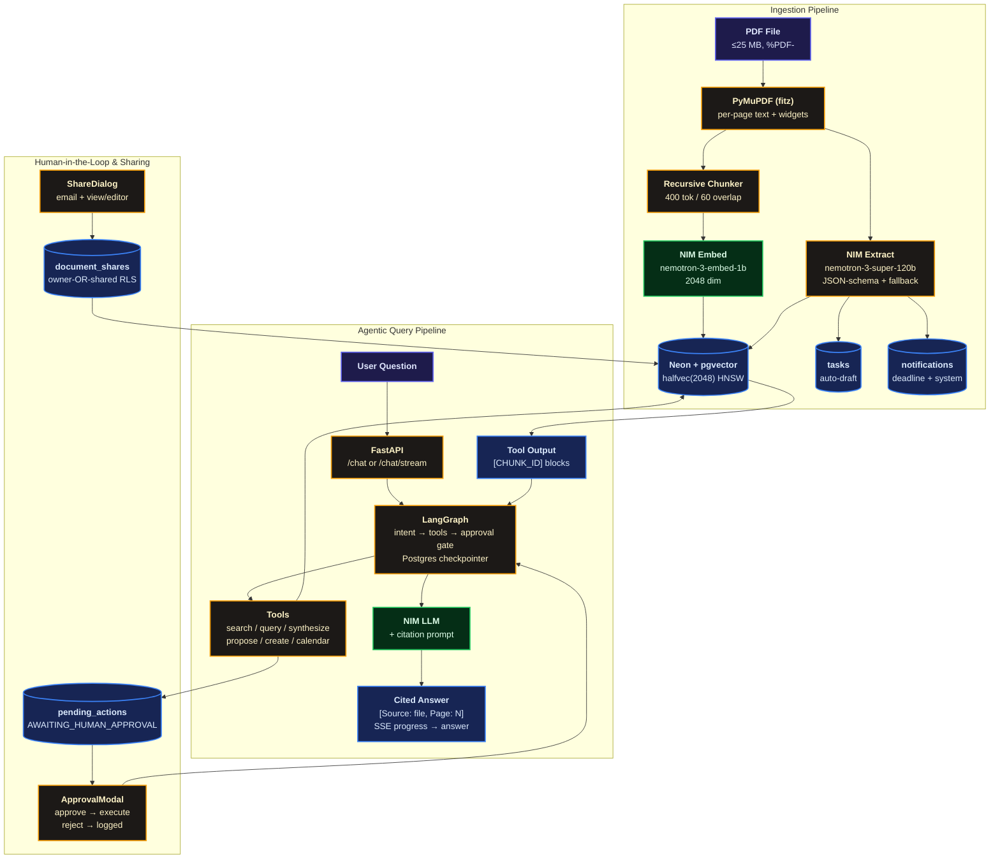

# Prova — Your Personal Document Assistant

> Upload your bills, policies, and leases. Ask anything. Get answers with the exact page they came from.

Prova is a private document assistant. It reads your PDFs, remembers dates and amounts, and answers questions like “when does my car insurance expire?” with a source chip that points to the file, page, and quote. If it needs to do something for you — create a task, share a document — it asks first.

I built it because paperwork is where life hides deadlines. Prova keeps them where you can see them.

## Overview

Drop a PDF in. Prova pulls the text page by page, chunks it, embeds it, and files away the facts (sender, amount, due date). If there’s a deadline, it drafts a task.

Ask a question and it looks up your own documents first. Simple questions get a direct answer with citations. Harder ones that span multiple files run as a visible stream — “checked your policy… comparing against the quote…” — so you see progress instead of staring at a spinner. Every fact comes with `[Source: filename, Page N]` that you can click.

Nothing important happens without you. Actions that touch the outside world sit as approval cards on your dashboard. Approve or reject in one tap. Everything is private to your account; sharing only happens if you share by email.

## Features

- **Answers from your documents, not guesses.** It searches first, then answers. If your files don’t have the answer, it says so.
- **Proof with every fact.** Citations are enforced — the app only accepts references to text the model actually saw. No fake page numbers.
- **Cross-document comparisons, out loud.** Comparisons stream over SSE so long runs don’t time out and you see each step.
- **You’re the gate.** External actions pause as `pending_actions`. They expire after 24 hours, and every decision is logged.
- **Deadlines that nudge you.** Documents expiring in 30 days show up in the notification center with a live feed. Tasks are auto-drafted from due dates.
- **Share carefully, charge fairly.** Share a lease or warranty by email (view or editor, Pro). Free is 5 documents; Pro is ₹99/month for unlimited, comparisons, approvals, calendar exports, and sharing. Upgrade via Razorpay or one tap in demo mode.
- **Doesn’t fall over.** If the AI is slow, your upload is still saved and searchable (marked for review). Scanned-image PDFs get a clear message instead of failing silently.

## Benchmark Results

Tested on Docker Compose + Neon + Redis 7 + NVIDIA NIM. Small PDFs (2 chunks). NIM latency varies with server load, so treat these as what I saw, not promises.

Live run: 2026-09-11. Chat tuning: 2026-09-13.

| Operation | Measured | Notes |
|-----------|----------|-------|
| Async ingestion (upload-async → `ready`) | ~18 s (17.6 s) | Embed + extract 200 each, 2 chunks, `ingestion_complete` SSE |
| Cited chat turn (120B, single-doc) | ~5 s | Correct answer + page-1 citation chip |
| Fast-lane chat (single retrieval) | 6–7 s (7.4 s / 6.2 s) | Default for everything except comparisons/actions |
| Summary (“explain this document”) | ~11 s (10.9 s) | Templated sections, citations, leak guards |
| Comparison (multi-doc agent loop) | ~26 s (25.6 s) | 3 scoped searches + cited matrix |
| Stream first token | ~2 s | Tokens render live; citations land on final event |
| Cold login (idle Neon wake) | 3.4 s | Warm logins are faster |
| Rate-limit trip | 429 + `Retry-After` | Auth 5/min verified live |
| Delete → transparency log | 204, 0 docs / 0 chunks / 5 audits | Full cascade verified |

Things I tried and dropped: reasoning `nano-30B` takes ~45–50 s per turn; `Lightning-30B` is fast (~16 s) but answers poorly; `kimi-k2.6` and `nano-3-30B` aren’t entitled on this NIM key (404). So chat stays on the 120B model.

## Architecture



### How it runs

How the pieces are deployed and scaled:

```
                ┌─────────────┐   HTTPS    ┌──────────────────┐
                │  Next.js 15 │ ─────────► │  backend-api x4  │
                │  frontend   │ ◄───────── │  FastAPI workers │
                │  :3000      │    SSE     │  :8000           │
                └─────────────┘            └────┬───┬─────────┘
                                                │   │
                              shared_uploads    │   │  document_pipeline / celery_dlq
                              /app/uploads      │   ▼
                           ┌────────────────────┐  ┌──────────────┐
                           │   celery-worker xN │◄─│ Redis 7+     │
                           │   --max-tasks-     │  │ broker+result│
                           │   per-child=50     │  │ + Pub/Sub    │
                           └────────┬───────────┘  └──────────────┘
                                    │ NullPool, one conn/task
                                    ▼
                           ┌────────────────────┐      ┌──────────────────┐
                           │ Neon PostgreSQL    │◄─────│ NVIDIA NIM       │
                           │ pgvector halfvec   │ NIM  │ chat + embeddings│
                           │ RLS FORCE policies │ API  │ (transient only) │
                           └────────────────────┘      └──────────────────┘
```

Workers scale separately (`docker compose up --scale celery-worker=3`). Only API (`:8000`) and frontend (`:3000`) expose host ports. Chat streams in-process over SSE — it never goes through Celery or Redis.

A few details that matter: uploads return 202 with `document_id` + `job_id` and stream progress over Redis Pub/Sub → SSE. If a worker fails after retries, the job goes to `celery_dlq` where `handle_poison_pill_dlq` marks the doc `failed` and pushes an alert. Migrations run at boot under `pg_advisory_lock` with a 4-second bounded timeout so restarts don’t hang.

## Live-run notes (verified 2026-09-11, Docker + Neon + Redis + NIM)

- `docker compose up --build -d` brings up API `:8000` and frontend `:3000`. Compose reads the repo-root `.env` (billing keys live there, not `backend/.env`).
- Billing uses Razorpay test keys (Key ID + Key Secret + Plan ID). Webhook secret is optional — checkout still opens, only the post-payment tier flip needs it. No keys at all? It falls back to demo-mode instant upgrade.
- Sync uploads briefly show `processing` — that status is expected in `chk_documents_status`.

## Tech Stack

| Layer | Technology |
|-------|------------|
| Frontend | Next.js 15.1.6 (App Router, React 19) + TypeScript + Tailwind + Tabler.io (`@tabler/core` 1.5.1, `@tabler/icons-react` 3.46.0) |
| Backend | Python 3.11 + FastAPI 0.115.6 + Uvicorn + SQLAlchemy[asyncio] + asyncpg |
| AI | NVIDIA NIM `nemotron-3-super-120b-a12b` + `nemotron-3-embed-1b` (2048) via `openai.AsyncOpenAI` + `httpx` (15 s default; 30 s + 1 retry for chat/extraction) |
| Orchestration | LangGraph 0.2.59 + `AsyncPostgresSaver` (same Neon DB; falls back to built-in loop) + `langchain-openai` |
| Data | Neon Serverless Postgres + `pgvector` (`halfvec(2048)` HNSW `halfvec_cosine_ops`) + RLS `FORCE` (id + email) |
| Parsing | PyMuPDF (`fitz`) — sorted reading order, block fallback, AcroForm widgets, scanned-page detection; `page_number` kept for citations |
| Auth | Self-managed JWT (`PyJWT` + `bcrypt` 72B cap) carrying id + email for shared-access RLS |
| Billing | Razorpay 1.4.2 Test Mode (`rzp_test_*`); `/webhook` verifies HMAC signature, needs `RAZORPAY_WEBHOOK_SECRET`; demo-mode flip when keys absent |
| Realtime | `sse-starlette` — `POST /chat/stream` progress frames + `GET /notifications/stream` live feed |
| Deploy | Vercel (frontend) · Render / Docker (backend, `render.yaml` Blueprint) · Neon (db) |

## Data Model

| Table | Purpose | RLS |
|-------|---------|-----|
| `users` | self-managed identity + `subscription_tier` (`free`/`pro`), `razorpay_customer_id`, `document_count` | — (login must read before tenant ctx) |
| `documents` | `filename`, `category`, `status` (`ready`/`needs_review`), `raw_text`, `metadata JSONB`, `has_actionable_deadline` | `FORCE`, owner-OR-shared |
| `document_chunks` | `document_id`, `user_id`, `filename`, `page_number`, `chunk_index`, `content`, `embedding halfvec(2048)` | `FORCE`, owner-OR-shared |
| `document_shares` | `document_id`, `owner_id`, `shared_with_email`, `permission` (`view`/`editor`) | `FORCE`, owner-OR-recipient |
| `pending_actions` | `action_type`, `payload JSONB`, `status` (`pending`/`approved`/`rejected`/`expired`), `expires_at` (+24 h) | `FORCE` |
| `notifications` | `title`, `message`, `type` (`deadline`/`system`/`sharing`), `is_read`, `due_date` | `FORCE` |
| `tasks` | `title`, `due_date DATE`, `status`, `document_id ON DELETE CASCADE` | `FORCE` |
| `audit_logs` | `action_type`, `tool_name`, `input/output JSONB`, `execution_time_ms` | `FORCE` |

Indexes on `user_id`, `metadata->>'action_deadline'`, `category`, `document_shares(shared_with_email)`, `pending_actions(status)`, unread notifications, and `USING hnsw ((embedding::halfvec(2048)) halfvec_cosine_ops)`.

Tier rules live in the API, not the database: free owners get 403 past 5 uploads and on share creation; `synthesize_documents`, calendar export, and approvals are Pro-only.

## Technical Decisions Log

These are the calls I made under tight constraints: one Neon DB, NIM credits, Render’s 4-worker limit, and Razorpay for India.

| Decision | Alternatives | Trade-off | Why this |
|---|---|---|---|
| Neon + `pgvector` `halfvec(2048)` HNSW | Pinecone / Qdrant / full `vector(2048)` | `halfvec` halves memory/storage vs `vector`; HNSW is <10 ms ANN but heavier to build than IVFFlat; no extra service to run | One DB for everything, fits Neon’s 10-connection pooled budget (`pool_size=5, max_overflow=5`). IVF would need re-tuning as data grows. |
| NVIDIA NIM `nemotron-3-super-120B` + `nemotron-3-embed-1b` | OpenAI GPT-4o + `text-embedding-3-large` | NIM is cheaper on this credit and 2048-dim; ~5 s cited answers / ~26 s comparisons (measured) vs OpenAI’s lower variance but USD billing and 3072-dim | Credit was already entitled, single `AsyncOpenAI` client, and we fallback to `needs_review` instead of failing when the model is down. |
| LangGraph `AsyncPostgresSaver` + fallback loop | Plain loop / Temporal / Step Functions | Graph gives interrupt → approve → resume with durable checkpoints; fallback loop means approvals still work if the checkpoint table isn’t there | Approvals must survive restarts (24 h expiry, audit). Reuses Neon, no new infra like Temporal. |
| Celery + Redis 7 (`document_pipeline` + `celery_dlq`) | RQ / BullMQ / SQS | Celery gives bounded concurrency, `--max-tasks-per-child=50`, and a real DLQ; heavier than RQ and needs Redis | Need 2→4→8 s backoff, poison-pill isolation (`handle_poison_pill_dlq`), and stage-boundary cancellation — RQ doesn’t have per-queue max-tasks controls. |
| PyMuPDF (`fitz`) | pdfminer.six / pypdf | PyMuPDF keeps reading order, AcroForm widgets, and flags scanned pages; it’s a native dep vs pure-Python | Citations need exact `page_number`; scanned PDFs should explain instead of silently dropping text. |
| Self-managed JWT (dual GUC `id+email`) | Clerk / Auth0 / Supabase Auth | Own JWT carries both `app.current_user_id` and `email` for RLS owner-OR-shared; no vendor lock, but we own rotation | Sharing needs `shared_with_email` in RLS — external auth wouldn’t propagate that without custom claims. |
| `RLS FORCE` on every table | App-layer `WHERE user_id=` | DB enforces tenant isolation so a missed filter can’t leak; every session (including Celery `NullPool` workers) must set GUCs | Security in the DB, not the app. Split `audit_logs` policies allow system/DLQ rows with NULL tenant. |
| `sse-starlette` (SSE) | WebSockets / polling | SSE is one-way, works behind Render/Vercel proxies, auto-reconnects; no bidirectional overhead | Chat progress and notifications are server-push only. Tokens stream live, citations settle on the final event. |
| Razorpay Test Mode + HMAC webhook | Stripe | Razorpay supports UPI/cards and ₹99 plans natively; webhook fails closed if HMAC doesn’t match | India market; demo-mode flip when keys are absent keeps local dev friction at zero. |
| Render Blueprint + `pg_advisory_lock` + Vercel + Neon pooler `:6543` | Kubernetes / ECS / self-hosted Postgres | Blueprint gives 4× API workers; `/app/uploads` is ephemeral on redeploy; pooler caps at 10 conns | Minimal ops. Advisory lock with 4 s timeout means migrations don’t hang boot. Add a Render Disk on `/app/uploads` if redeploys annoy you. |

## Project Structure

```text
Prova/
├── backend/
│   ├── Dockerfile               # init_db + uvicorn on $PORT, /health check
│   ├── app/
│   │   ├── main.py              # FastAPI, CORS, 504/502 handlers, /health (langgraph/tier flags), /
│   │   ├── config.py            # Settings (DATABASE_URL, NVIDIA_*, JWT, FREE_DOCUMENT_LIMIT, Razorpay, SYNTHESIZE caps)
│   │   ├── database.py          # normalize_database_url, engine, RLS id+email helpers, audit
│   │   ├── nim.py               # AsyncOpenAI client, embed_texts / chat_completion(timeout, retries)
│   │   ├── ingestion.py         # PyMuPDF (sort/widgets/scan flags), chunker, extraction + fallback
│   │   ├── schemas.py           # Pydantic v2 + Share / PendingAction / Notification / Checkout schemas
│   │   ├── security.py          # bcrypt + JWT (CurrentUser id+email)
│   │   ├── agent/
│   │   │   ├── loop.py          # tier-aware tool loop (fallback engine), free hides synthesize
│   │   │   ├── graph.py         # LangGraph StateGraph + interrupt() gate + AsyncPostgresSaver
│   │   │   └── tools.py         # 6 tools, owner-OR-shared SQL: search, query, create, synthesize, propose, calendar
│   │   ├── services/
│   │   │   ├── billing.py       # check_tier_limit(403), require_pro, Razorpay/demo checkout + webhook
│   │   │   └── notifications.py # 30-day deadline sync, pending TTL expiry, SSE frames
│   │   └── routers/
│   │       ├── auth.py          # signup / login / me (tier + count)
│   │       ├── documents.py     # tier-gated upload, owner-OR-shared list, share CRUD (Pro create)
│   │       ├── chat.py          # render_citations (verbatim 20-word) + POST /chat/stream (SSE)
│   │       ├── tasks.py         # list (due-date order) + PATCH + DELETE(204) + GET /{id}/calendar (.ics, Pro)
│   │       ├── pending_actions.py # list pending + POST /{id}/decide (approve executes, resumes graph)
│   │       ├── notifications.py # list (auto-syncs deadlines) + PATCH read + DELETE + GET /stream
│   │       └── billing.py       # /status + /create-checkout-session + /webhook
│   ├── schema.sql               # Phase 1 DDL + halfvec HNSW + RLS FORCE + tenant policies
│   ├── migrations/phase2.sql    # tiers, shares, pending_actions, notifications + shared-access RLS
│   ├── requirements.txt         # Pinned (fastapi 0.115.6, langgraph 0.2.59, razorpay 1.4.2, sse-starlette 2.2.1, ...)
│   └── .env.example
├── frontend/
│   ├── src/app/page.tsx         # Dashboard (tier badge, bell, approvals card, share, streamed chat)
│   ├── src/app/pricing/page.tsx # Free vs Pro + Razorpay/demo upgrade
│   ├── src/app/notifications/page.tsx # Alert center (30-day deadlines, shares, system)
│   ├── src/app/login/page.tsx   # Sign in / Create account
│   ├── src/components/ApprovalModal.tsx  # approve/reject drafted actions
│   ├── src/components/ShareDialog.tsx    # email share + permission + revoke
│   ├── src/components/CitationChip.tsx   # interactive source chips
│   ├── src/components/ChatPane.tsx  # SSE stream with live stage text, scope select
│   ├── src/components/DocumentList.tsx, Dropzone.tsx, TaskList.tsx  # share btn, 403 notices, .ics download
│   ├── src/lib/api.ts, src/lib/sse.ts, src/lib/utils.ts
│   └── next.config.ts, tailwind.config.ts, tsconfig.json, .env.local.example
├── render.yaml                  # Render Blueprint (Docker web service + env vars)
├── README.md
├── RUN.md
└── .gitignore
```

## Try it

**Structured (via `query_structured_data`)**
- Which policies expire next month?
- List my utility bills due before 2026-10-01.
- Show all Vehicle documents from AutoCare Motors.

**Semantic (via `search_documents` + citation)**
- When does my car insurance expire? — should cite the policy Page 1.
- What does my rental agreement say about the deposit?
- What are the terms for vehicle service invoice INV-2026-8844?

**Comparative (via `synthesize_documents`, Pro — streams progress)**
- Does my home insurance cover the water damage on this repair quote?
- Compare the renewal terms across my two insurance policies.

**Action (via `create_task` / `propose_task_action`)**
- Create a task to renew my insurance on 2026-10-10.
- Remind me to pay the electricity bill by Friday — drafts an approval card first.

## Run locally

| Component | Local URL | How |
|-----------|-----------|-----|
| Frontend | `http://localhost:3002` | `npm run dev -- --port 3002` (Next 15.1.6) |
| Backend | `http://127.0.0.1:8002` | `uvicorn app.main:app --host 127.0.0.1 --port 8002` (`/docs` for Swagger) |

Production: Vercel serves `frontend/` with `NEXT_PUBLIC_API_BASE_URL` pointing at Render, where `render.yaml` runs `backend/Dockerfile` (migrations on boot, `/health` checks) against Neon.

Without Razorpay keys, billing runs in demo mode — checkout flips the tier instantly with the same audit trail. Live mode needs the webhook `POST /billing/webhook` for `subscription.activated` + `subscription.charged` and `RAZORPAY_WEBHOOK_SECRET`.

## Author

Built with ❤️
